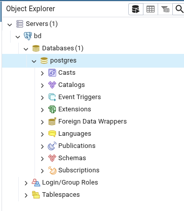

# Pasos para Ejecutar el Proyecto

Insertar archivo .env 

Insertar archivo con datos en carpeta data

Inicia los servicios con Docker:

    docker compose up --build

FastAPI estará en http://localhost:8000

(Al poner /docs aparecen todos los endpoints con su descripcion)

PostgreSQL estará accesible en localhost:5432

Para detener los servicios:

    docker compose down

Para subir archivos csv:

http://localhost:5050

usuario y contraseña definidos en archivo .env (puedes cambiar el correo, no reocomiendo cambiar la contraseña)

para conectar, usar los sig datos:

hostname: db
port: 5432

username: postgres
password: postgres

abrir servidor en menu lateral y luego seleccionar la base de datos postgres, ahi hacer click en query tool (boton que esta al lado de donde dice object explorer)

una vez en la ventana pegar el siguiente codigo y ejecutar la query:

    COPY public.obras_medicion(
        "ID.MED.OBR",
        id_informante,
        id_junta,
        region,
        provincia,
        comuna,
        utm_norte,
        utm_este,
        huso,
        codigo,
        naturaleza,
        cod_cuenca,
        nom_cuenca,
        cod_acuifero,
        nom_acuifero,
        sector_sha,
        cod_subcuenca,
        nom_subcuenca,
        cod_subsubcuenca,
        nom_subsubcuenca,
        cod_fuente_superficial,
        nom_fuente_superficial,
        nombre_fuente,
        extrae_canal,
        nombre_canal,
        apr,
        puntoalt,
        tiene_motobomba,
        tiene_bocatoma,
        tipo_bocatoma,
        descarga_cauce_natural,
        habilitada,
        motivo_deshabilitada,
        motivo_otra,
        estado_obra,
        motivo_cambio_estado,
        fecha_cambio_estado,
        motivo_cambio_informante,
        nombre_obra,
        tipo_obra,
        cod_sector_sha,
        representa_junta,
        parte_junta,
        "RUT.INF.",
        "TIP.INF.",
        "NOMB.INF.",
        "A.PAT.INF.",
        "A.MAT.INF.",
        nacionalidad,
        "GEN.INF",
        "REG.INF.",
        "PROV.INF.",
        "COM.INF.",
        "DIR.INF",
        "TEL.FIJ.INF.",
        "TEL.MOV.INF",
        "EMAIL.INF",
        "RUT.USU.",
        "TIP.USU.",
        "NOMB.USU.",
        "A.PAT.USU.",
        "A.MAT.USU.",
        "REG.USU.",
        "PRO.USU.",
        com_usu,
        gen_usu,
        dir_usu,
        tel_fij_usu,
        tel_mov_usu,
        email_usu,
        id_med,
        id_obra_captacion,
        canal_transmision,
        tipo_medicion,
        fecha_medicion,
        fecha_origen,
        caudal,
        altura_limnimetrica,
        totalizador,
        nivel_freatico,
        rut_empresa
    )
    FROM '/var/lib/postgresql/datafiles/OBRAS_MEDICION.csv'
    WITH (
        FORMAT csv,
        HEADER true,
        DELIMITER ';',
        QUOTE '"'
    );